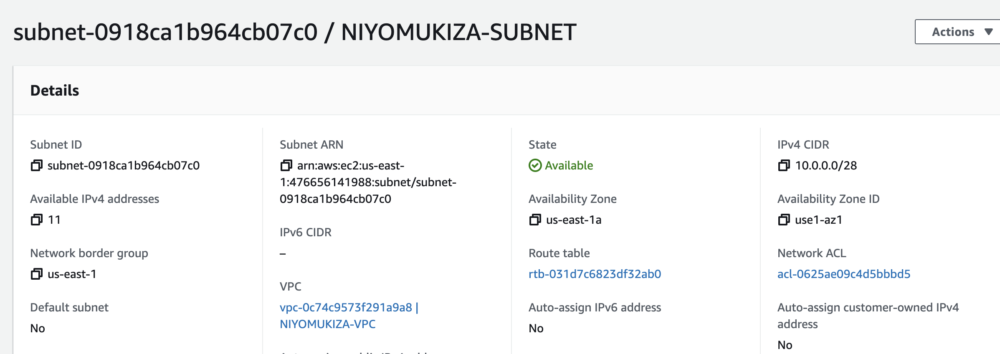
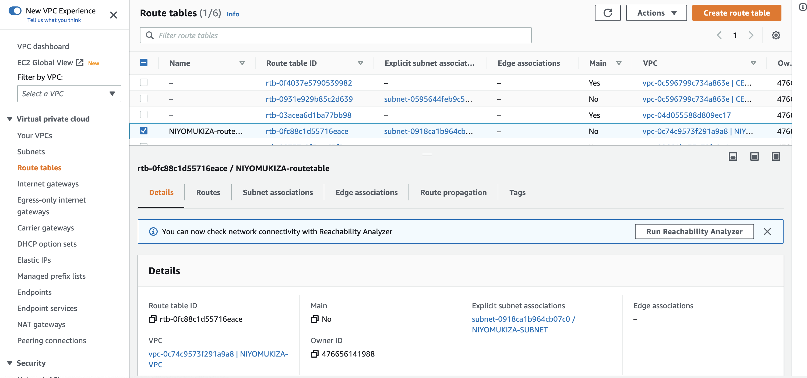
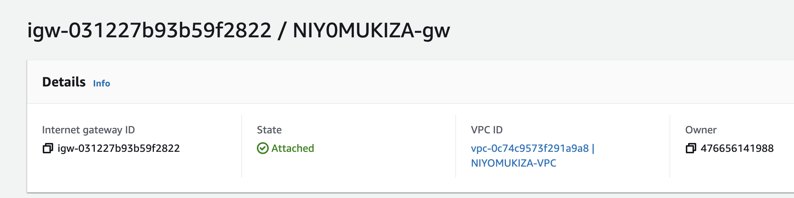
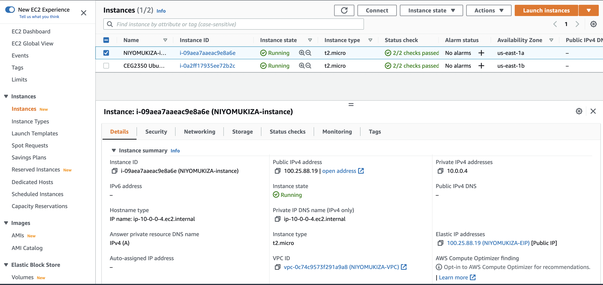
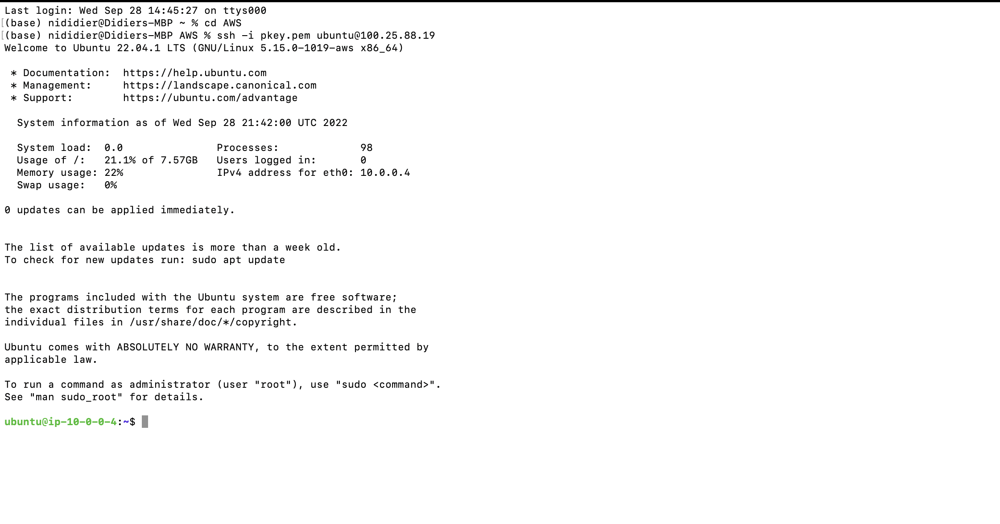

## AWS RESOURCE GUIDE
1. ### **BUILD YOUR VPC:**
VPC stands for virtual private network. Metaphorically,it is your private room on aws platform that you can use to store your resources. It is logically isolated from the rest of  AWS resources
   +  Open the Amazon VPC console 
   +  On the VPC Dashboard, choose Launch VPC Wizard. If you can't see it, type vpc in your search bar
   + Select configurations of your VPC such as name,cidr block,etc
  
  
  
2. ### **CREATE SUBNETS:**   
     A subnet is a range of IP addresses in your VPC. You can have one or many subnets in your vpc. Also, if you can have public and private subnet depending on use.    
     
     **To add a subnet to your VPC**

Open the Amazon VPC console at https://console.aws.amazon.com/vpc/.

+ Choose Subnets
+ Create subnet

For VPC ID: Choose the VPC for the subnet.
+ Enter a name for your subnet

Be sure to check your or leave  No Preference to let AWS choose one for you.

+ Enter an IPv4 CIDR block for your subnet

If a subnet is associated with a route table that has a route to an internet gateway, it's known as a public subnet. 

If a subnet is associated with a route table that does not have a route to an internet gateway, it's known as a private subnet.

3. ### Configure the route table
      A route table controls where network traffic is directed in your VPC. Each subnet in your VPC must be associated with a route table, which controls the routing for the subnet (subnet route table), otherwise the main routing table will be the defaul t configuration

      + Choose create route table
      + Give it a name
      + Choose vpc
      + Associate a subnet with a specific route table
      
      

4. ### CREATE INTERNET GATEWAY
      An internet gateway enables your resources to talk to the outside VPC world.Similarly, resources on the internet can initiate a connection to resources in your subnet using the public IPv4 address or IPv6 address. 
      
      + Navigate to the AWS console -> Services.
      + Under the Networking & Content Delivery section, choose VPC.
      + Navigate to Virtual Private Cloud -> Internet Gateways.
      + Click Create Internet Gateway.
      + Type a name in the Name tag text box and click Yes, Create. ...
      + Click Attach to VPC.
      
      

5. ### CREATE SECURITY GROUP:
   AWS security groups acts as a virtual firewall for your EC2 instances. They control both incoming and outgoing traffic to/from your instances. Note that all outboung traffic are allowed by default.
   For inbound access you can choose who to allow, and the specific ports they can reach

   Protocol: The protocol to allow. The most common protocols are 6 (TCP), 17 (UDP), and 1 (ICMP).

   + Port range: For TCP, UDP, or a custom protocol, the range of ports to allow. You can specify a single port number (for example, 22), or range of port numbers (for example, 7000-8000).

   + ICMP type and code: For ICMP, the ICMP type and code. For example, use type 8 for ICMP Echo Request or type 128 for ICMPv6 Echo Request.

   + Source or destination: The source (inbound rules) or destination (outbound rules) for the traffic to allow. Specify one of the following:
   
   

6. ### BUILD YOUR INSTANCES:
     Now that we have laid out the network, it is time to build instances. AWS offers varieties of systems. Here we will be building Ubuntu instance.
    
    +  Select AMI 
    +  Name it
    +  Instance type 
    +  Attach your instance to your VPC
    + Choose storage 
  
    

Now let's check if we can remotely connect to the instance we have created through the terminal 

Can we switch users? of course yes. This what you need to do:

   1. Go to /etc folder : **cd /etc**
   2. List all files that start with h : **ls h**
   3. Copy the hostname file into hostname.old file: **sudo cp hostaname to hostname.old**
   4. To edit hostname and hosts file, you will need elevated permissions: **sudo su**

   5. Edit the content of those files and replace user with names you want to use.

You will need to reboot the system if you want to save changes permanently. **Heads up!** You may have trouble SSHing your aws instance after a reboot. You need go back to AWS management console and manually restart your instance.

END.