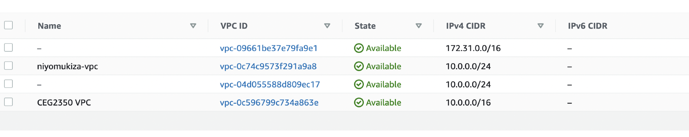

## AWS RESOURCE GUIDE
1. ### **CREATE A VPC:**
VPC stands for virtual private network. Metaphorically,it is your private room on aws platform that you can use to store your resources. It is logically isolated from the rest of  AWS resources
   +  Open the Amazon VPC console 
   +  On the VPC Dashboard, choose Launch VPC Wizard. If you can't see it, type vpc in your search bar
   + Select configurations of your VPC such as name,cidr block,etc
  
  
  
2. ### **CREATE SUBNETS:**          